# 剪藏（Wincpl）

Windows 11 本地剪贴板与代码片段工具。数据只保存在本机，使用 Rust + Tauri 2 构建，支持文本、图片、标签、即时搜索、全局快捷键、Windows 毛玻璃窗口和 Windows.Media.Ocr 离线 OCR。

项目地址：<https://github.com/anlen123/wincpl>

## 0.1.2 更新

- 托盘左键呼出剪贴板面板，右键保留菜单；重复左键不会关闭面板。
- 搜索框为空时用左右方向键切换标签，输入文字时可用 `Alt+左右键`。
- 剪贴历史和代码片段均支持 `#XX` 标签专用搜索，可与普通关键词组合。
- 标签旁的 `×` 可全局移除标签关联，保留记录、图片及其他标签。
- Windows 与 Android 同步升级至 0.1.2；Android `versionCode` 为 3，沿用原签名密钥。

## 0.1.1 更新

- 修复 Windows 设置面板的配对二维码被 CSP 拦截而无法显示。
- 修复重新生成手机令牌时，旧监听端口尚未释放就重启导致的端口占用错误。
- Windows 桌面端与 Android 手机端统一升级到 0.1.1；Android `versionCode` 升至 2，沿用原签名密钥。

## 界面预览

| 剪贴板历史 | 用文字搜到图片（OCR） |
| --- | --- |
| 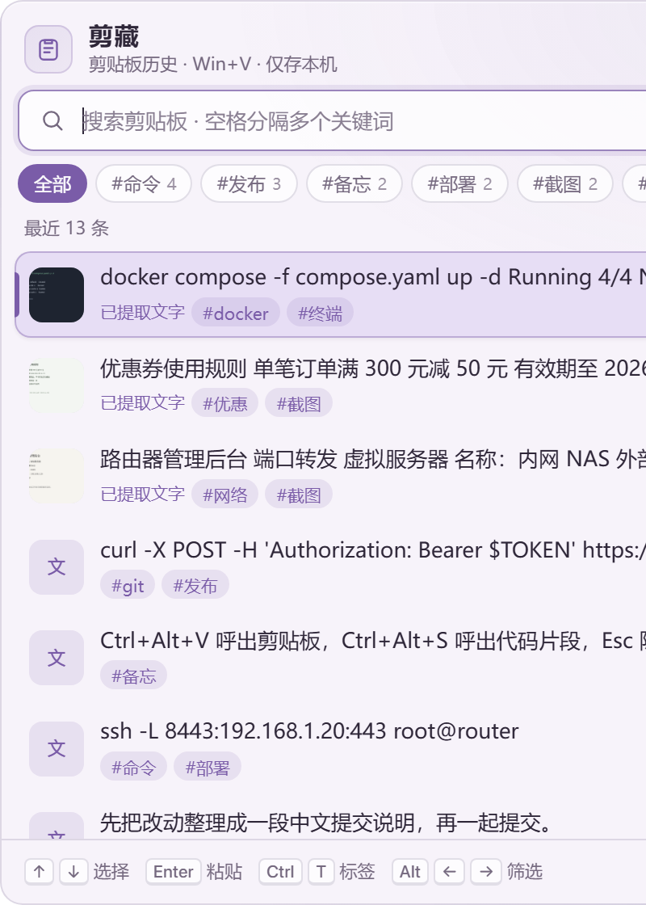 | 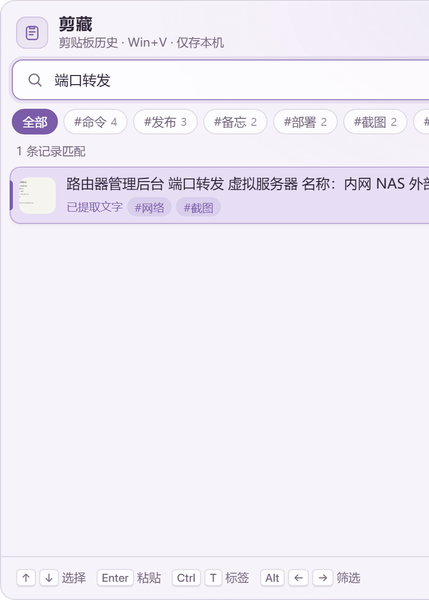 |

| 代码片段库 | 代码片段预览 |
| --- | --- |
| 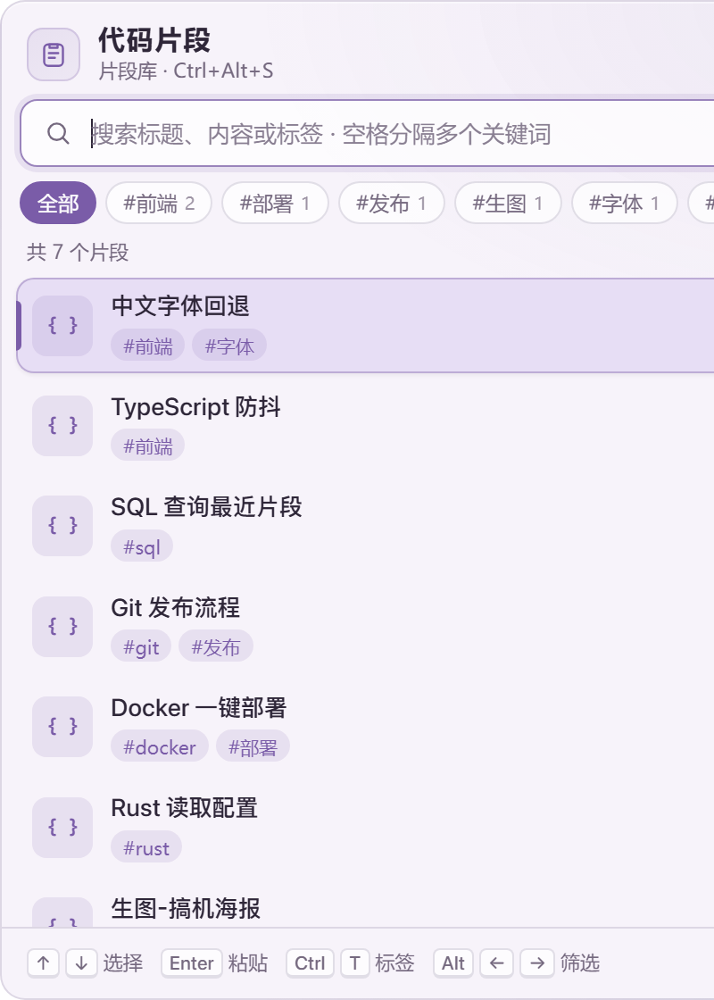 | 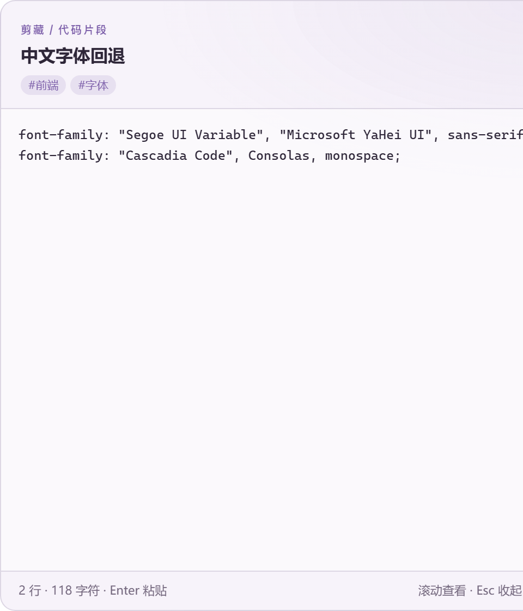 |

| 图片预览 | 标签筛选 |
| --- | --- |
| 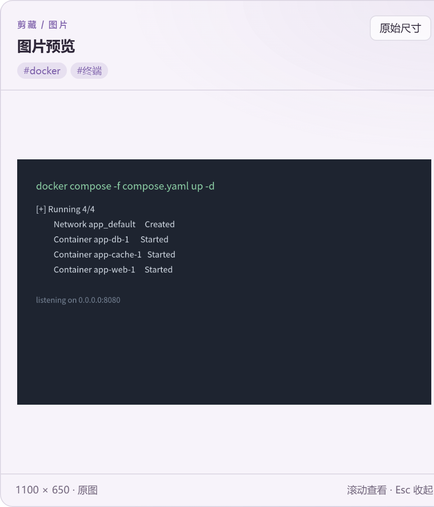 | 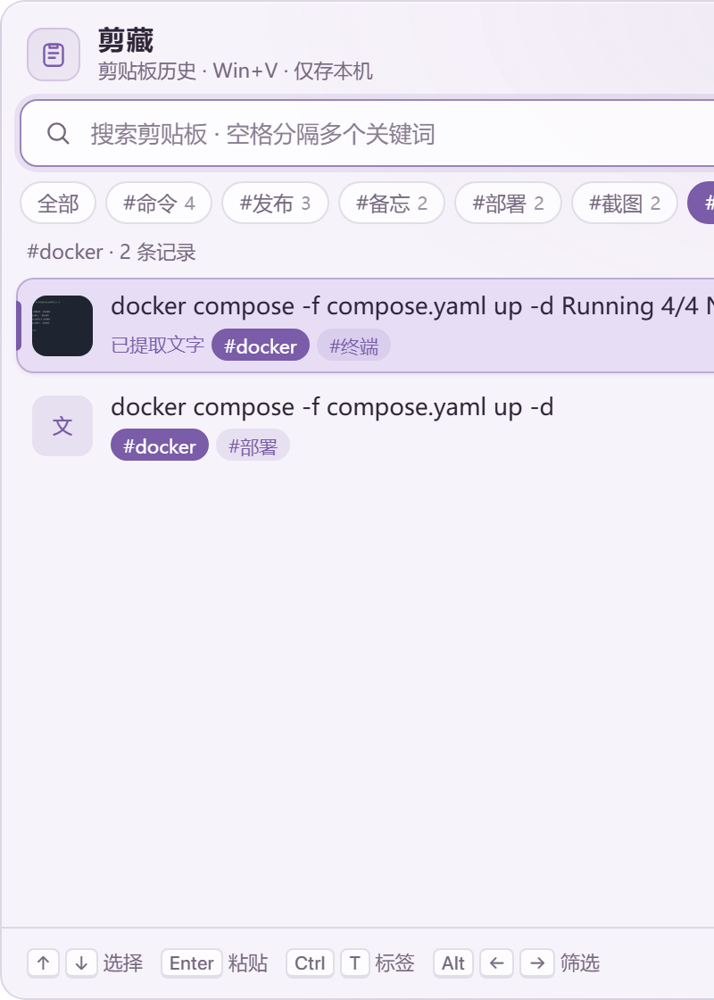 |

| 搜索结果在浮窗内高亮 | 应用内设置 |
| --- | --- |
| 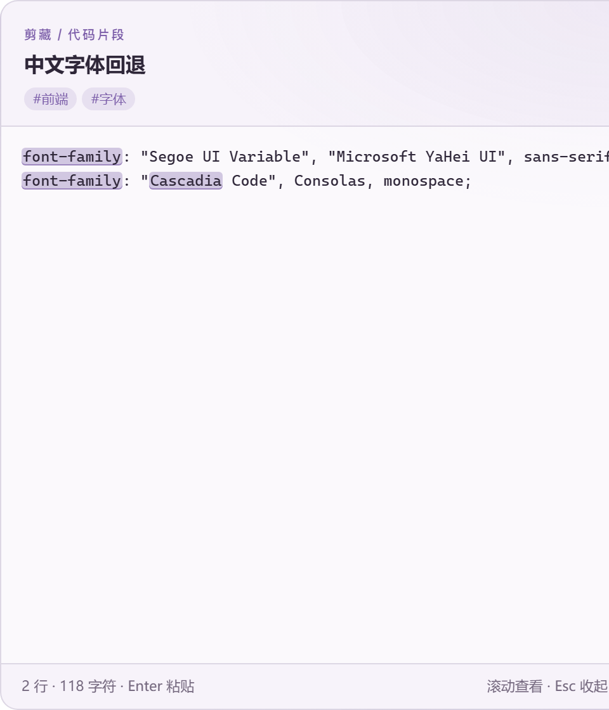 | 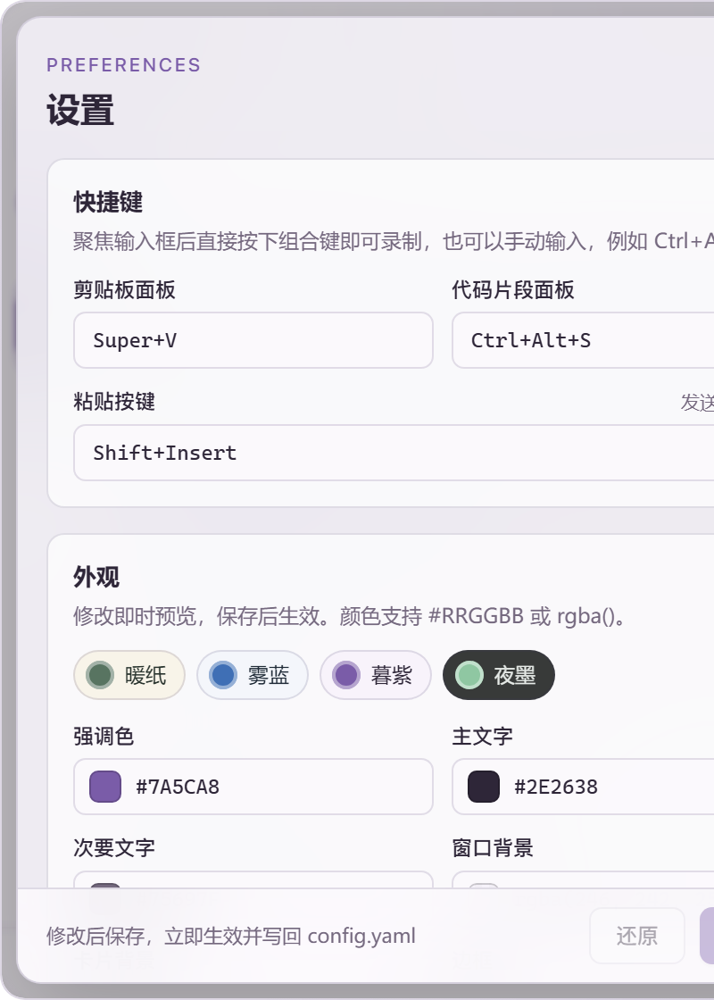 |

| 复制提示 · 文字 | 复制提示 · 图片 | 短信验证码提示 |
| --- | --- | --- |
| 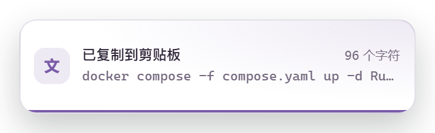 | 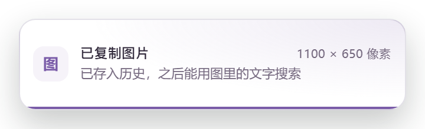 |  |

| 手机扫码配对 | 复制提示设置 |
| --- | --- |
| 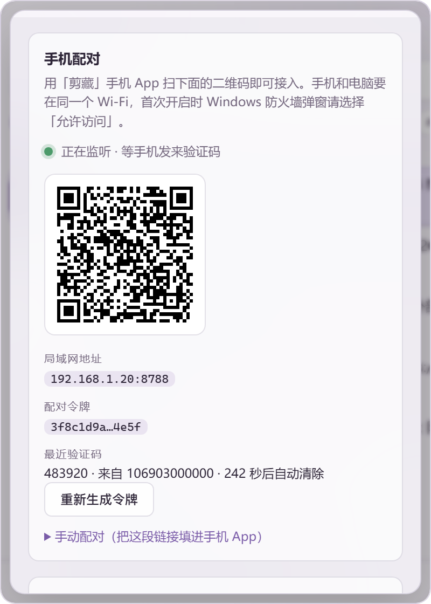 | 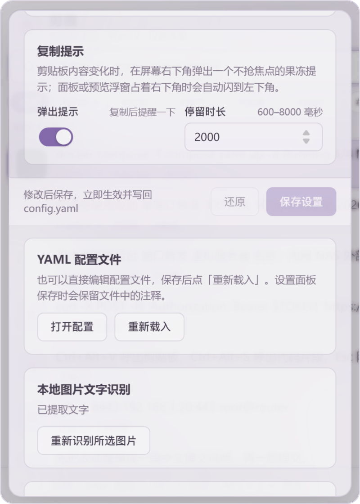 |

> 截图使用演示数据生成，不含任何真实剪贴板内容。

## 特色功能

- **文字搜图片**：用 Windows 本地 OCR 提取图片里的文字并入库，之后直接输入文字就能从历史里搜到那张图，全程离线。截图里搜「端口转发」即可命中路由器后台截图。
- **无声调全拼搜索**：`nihao` / `NIHAO` 都能匹配「你好」，覆盖剪贴板正文和图片 OCR，已有历史会自动补全拼音。
- **多关键词“同时包含”**：用空格分隔多个关键词，`a b c` 只返回同时包含 a、b、c 的记录。
- **角落完整预览**：选中剪贴板条目或代码片段后自动在屏幕右下角显示完整内容，文字可滚动、代码片段保留缩进与等宽字体、图片支持原始尺寸。面板正好停在右下角时预览自动改到左下角，避免遮挡；预览出现时不抢搜索焦点。
- **浮窗内搜索高亮**：搜索关键词会在预览浮窗里高亮显示，大小写不敏感、多个关键词同时高亮；列表本身保持简洁不做高亮。
- **标签与快速筛选**：剪贴板和代码片段都能打标签，`Ctrl+T` 编辑所选条目的标签，搜索框下方标签栏一键筛选（`Alt+←/→` 切换，`Esc` 清除），卡片标签也可直接点击筛选。
- **复制提示浮窗**：剪贴板内容一变，屏幕右下角就弹出一个果冻回弹的提示，写明刚复制了几行/几个字符和内容预览；不抢焦点、几秒后自动消失。面板或预览浮窗占着右下角时提示会自动闪到左下角，自己的粘贴动作不会重复提示。
- **手机验证码直送电脑**：手机装一个小 App 扫一下电脑设置里的二维码即可配对（纯局域网，带令牌鉴权）。之后手机收到短信验证码时，验证码会自动写进电脑剪贴板并弹出果冻提示，不用再低头看手机；验证码在电脑上只短暂保留（默认 300 秒）就自动清除。
- **应用内设置**：快捷键录制、取色器、主题预设、字体字号、窗口大小和历史限制都能在设置面板里直接改，实时预览并写回 `config.yaml`（保留注释）；也支持手动编辑 YAML。
- **全局快捷键与系统托盘**：`Ctrl+Alt+V` 呼出剪贴板、`Ctrl+Alt+S` 呼出代码片段，驻留托盘不占任务栏。
- **本地优先**：SQLite 持久化，历史、图片、配置都只在本机；重复复制的内容会去重并置顶。

## 功能

- `Ctrl+Alt+V` 呼出剪贴板面板，默认显示最新 20 条记录。
- 支持文本和图片；图片保留原图，并生成缩略图。
- 呼出后直接输入即可即时搜索，不需要额外按搜索键；用空格分隔多个关键词时按“同时包含”匹配，例如 `a b c` 只返回同时包含 a、b、c 的记录。
- 使用 Windows 本地 OCR 提取图片文字，OCR 文本可参与搜索。
- 支持无声调全拼搜索：`nihao` / `NIHAO` 可匹配“你好”，覆盖剪贴板正文和图片 OCR；已有历史会自动补全拼音。
- 选中剪贴板条目或代码片段后，在当前显示器右下角显示完整预览：文字可滚动，代码片段以等宽字体保留缩进，图片可切换适应窗口和原始尺寸。若面板本身正好呼出在右下角，预览会自动改到左下角，避免遮挡。预览自动出现时不抢搜索焦点。
- 搜索关键词会在预览浮窗内高亮（大小写不敏感、多关键词同时高亮），列表本身不高亮，保持简洁。
- 剪贴板记录和代码片段都支持标签：`Ctrl+T` 编辑所选条目的标签，搜索框下方的标签栏可一键筛选（`Alt+←/→` 切换，`Esc` 清除），卡片上的标签也可点击筛选。
- 上下方向键选择，回车或鼠标点击粘贴。
- `Ctrl+Alt+S` 呼出独立代码片段面板。
- 代码片段支持新增、编辑、删除、标签、标题与正文搜索、完整正文粘贴和 `Ctrl+Enter` 保存。
- 快捷键、粘贴按键、颜色、字体、字号、窗口大小和历史限制既可在应用内设置面板直接修改（支持按键录制、取色器、主题预设与实时预览），也可通过 YAML 配置。
- 剪贴板发生变化时在屏幕右下角弹出果冻提示，显示复制到的内容预览与字符数/像素尺寸；提示不抢焦点，面板或预览窗占住右下角时自动改到左下角，停留时长可配（默认 2 秒），可在设置里关闭。
- 手机（Android）扫码配对后，手机收到的短信验证码会自动写进电脑剪贴板并弹出「收到短信验证码」提示；识别不到验证码的短信会被手机端直接忽略，不用联网、不经任何第三方服务器。
- 验证码记录打上「验证码」标签，可以在标签栏里筛选查看；默认 300 秒后连同历史一起自动清除（时长可在设置里改）。
- 系统托盘驻留，不占用任务栏。
- SQLite 持久化；重复复制的相同内容会去重并置顶。

## 安装

### 使用 GitHub Actions 构建包

仓库的 Windows 工作流会在 Windows runner 上运行测试并构建 NSIS 安装包。

1. 打开仓库的 **Actions** 页面。
2. 选择 **Windows build**，点击 **Run workflow**，或推送代码触发构建。
3. 打开完成的 workflow run，在 **Artifacts** 下载 `jianzang-windows-x64`。
4. 在 Windows 11 上运行其中的 NSIS `.exe` 安装包。

本仓库只提交源码和构建配置，不提交 `.exe`、`.dll`、安装包或其他构建产物。

### 从源码构建安装包

要求：

- Windows 10/11 本机，推荐 Windows 11
- Node.js 22.12+（或更新的 LTS 版本）
- Rust stable，MSVC toolchain
- Visual Studio 2022 Build Tools，安装“使用 C++ 的桌面开发”工作负载
- Windows 10/11 SDK
- WebView2 Runtime；Windows 11 通常已经安装

在 PowerShell 中执行：

```powershell
git clone git@github.com:anlen123/wincpl.git
cd wincpl
powershell -ExecutionPolicy Bypass -File .\build-windows.ps1
```

安装包输出目录：

```text
src-tauri\target\release\bundle\nsis\
```

也可以直接执行：

```powershell
npm ci
npm run tauri build
```

### 构建手机端 APK

需要 JDK 17 与 Android SDK 34（`build-tools;34.0.0`、`platforms;android-34`）：

```bash
export JAVA_HOME=/path/to/jdk17 ANDROID_HOME=/path/to/android-sdk
cd android
./gradlew assembleRelease
# 产物：android/app/build/outputs/apk/release/app-release.apk
```

App 用仓库内 `android/app/keystore/jianzang.jks` 自签名（口令与别名均为 `jianzang`），方便任何人重新构建同一个包；不需要上架应用商店。

### 开发运行

在 Windows PowerShell 中执行：

```powershell
powershell -ExecutionPolicy Bypass -File .\build-windows.ps1 -Dev
```

或：

```powershell
npm ci
npm run tauri dev
```

仅运行前端预览：

```powershell
npm run dev
```

前端开发服务器默认地址为 `http://127.0.0.1:1420`。浏览器预览不具备 Windows 系统剪贴板监听、全局快捷键、焦点恢复、原生 OCR 和真实粘贴能力。

## 使用说明

### 呼出与粘贴

- `Ctrl+Alt+V`：呼出/收起剪贴板面板。
- `Ctrl+Alt+S`：呼出/收起代码片段面板。
- 托盘左键呼出剪贴板面板（已打开时不会关闭），右键显示配置/退出菜单。
- 面板中：`↑` / `↓` 选择，`Enter` 或鼠标左键粘贴，`Esc` 隐藏。
- `Ctrl+T`：编辑所选条目的标签。
- 搜索框为空时 `←/→` 切换标签筛选；输入文字时左右键保留光标移动，`Alt+←/→` 仍可切换标签。搜索框为空时按 `Esc` 先清除筛选。
- 代码片段编辑框内 `Ctrl+Enter` 保存。

### 搜索

- 直接输入即时搜索，无需额外按键。
- 空格分隔多个关键词表示“同时包含”。
- `#XX` 只匹配名称包含 `XX` 的标签，不匹配正文或标题；剪贴历史和代码片段面板都支持。例如 `#工作 rust` 同时要求带有包含「工作」的标签且匹配 `rust`；多个 `#标签` 也必须同时命中。
- 支持无声调全拼，例如 `duankou` 可匹配「端口」。
- 图片会先经过 OCR，识别出的文字同样参与搜索。
- 命中的关键词会在右侧预览浮窗内高亮，不区分大小写；列表本身不改变样式。

### 标签

- 在条目卡片上点击标签即可只看该标签。
- 搜索框下方的标签栏显示全部标签及数量，点「全部」取消筛选。
- 标签旁的 `×` 可直接删除标签。确认后会从所有剪贴历史和代码片段中移除同名标签，保留记录、图片、其他标签和原有时间戳；删除当前筛选标签后自动回到「全部」。

### 设置

- 打开面板底部的设置按钮，可直接修改快捷键、外观、历史、OCR 语言和复制提示，保存后立即生效并写回 `config.yaml`。
- 外观分组提供「暖纸 / 雾蓝 / 暮紫 / 夜墨」主题预设，也可用取色器逐项调整，修改即时预览。
- 「复制提示」分组可以开关右下角果冻提示，并调整停留时长（600–8000 毫秒）。
- 「手机验证码」分组打开开关后，「手机配对」卡片会生成二维码、局域网地址与令牌；点「重新生成令牌」会让旧手机立即失效。
- 需要手工编辑时，点击「打开 YAML 配置」，改完点「重新加载配置」。

### 手机验证码（Android）

电脑端只做两件事：在局域网里监听一个端口，把收到的验证码写进剪贴板。手机端 App 只做一件事：把含验证码的短信 POST 过来。

1. 电脑上打开剪藏 → 设置 → 「手机验证码」分组，打开开关。首次开启时 Windows 防火墙会询问，请选择「允许访问」（专用网络即可）。
2. 同一分组下方的「手机配对」卡片会显示二维码和 `192.168.x.x:8788` 这样的地址。
3. 手机上安装 `jianzang-phone-0.1.2.apk`（可以从 [Releases](https://github.com/anlen123/wincpl/releases) 下载），打开后点「扫描二维码」扫电脑上的二维码；扫不到时可用「手动配对」粘贴卡片里显示的配对链接。
4. 配对成功后开关会自动打开，并按提示授予「读取短信」权限（Android 13+ 还会询问通知权限）。
5. 用「测试连接」确认手机能连上电脑，之后收到的验证码就会自动出现在电脑上。

注意事项：

- 手机和电脑必须在同一个 Wi-Fi/局域网；电脑端监听的是明文 HTTP，但只有持有配对令牌的设备才能投递（令牌用「重新生成令牌」即可作废旧手机）。
- 重新生成令牌会先停止旧监听并等待端口释放，再使用新令牌启动；旧手机需要重新扫码。若仍提示端口占用，请检查是否有另一个剪藏实例或其他程序占用了配置端口。
- 手机端只转发正文里含「验证码 / 校验码 / 动态码 / 确认码 / 口令 / code / pin」等字样的短信，其余短信直接忽略，不读取、不上传任何其他短信内容。
- 电脑端最多识别 600 字符、8 KB 的请求体；识别不出 4–8 位数字码的短信会被拒绝并提示「没有验证码」。
- 验证码记录默认 300 秒后自动删除（`phone.code_ttl_secs`），你也可以在标签栏筛选「验证码」标签手动核对。
- App 需要自行安装（不在应用商店上架）；自签名密钥随仓库分发，构建方式见 `android/`。

## 配置

首次运行后生成：

```text
%LOCALAPPDATA%\com.winctl.jianzang\config.yaml
```

仓库中的 [`config.example.yaml`](config.example.yaml) 是完整配置示例。可以在应用设置面板中直接修改并保存（会写回该文件并保留注释），也可以从应用设置或托盘菜单打开配置文件，修改后选择重新加载配置。

常用配置：

```yaml
hotkeys:
  toggle: "Ctrl+Alt+V"
  snippets: "Ctrl+Alt+S"
  paste: "Shift+Insert"

history:
  display_limit: 20
  max_items: 100
  max_image_mb: 64
  max_text_kb: 256

ocr:
  language: "zh-Hans"

notify:
  enabled: true       # 剪贴板变化时在右下角弹出果冻提示
  duration_ms: 2000   # 提示停留时长，600–8000 毫秒

phone:
  enabled: false      # 手机验证码接入；在设置面板打开即可
  port: 8788          # 局域网监听端口，1024–65535
  token: ""           # 配对令牌，留空时自动生成；可在设置里重新生成
  code_ttl_secs: 300  # 验证码在历史里保留多久（30–3600 秒）后自动清除
```

以上为常用字段节选，完整配置还包含 `appearance` 等字段。请在生成的配置上修改，或以完整示例为基础，不要用本节片段覆盖整个文件。

快捷键格式支持 `Ctrl`、`Alt`、`Shift`、`Super`（也可写 `Win` / `Meta`）与一个字母、数字或功能键。两个呼出快捷键必须不同。可配置 `Win+Alt+V`，但 Windows 可能保留或占用 Win 组合；注册成功也不等于系统一定让出按键。`Win+V` 不作可靠性保证，程序不会强行接管它；单独的 `Win` 不支持。

OCR 使用 Windows 对应语言包。若中文识别不可用，请在 Windows 设置的“时间和语言 → 语言和区域 → 对应语言 → 语言选项”中安装 OCR 语言包。

拼音使用逐字默认读音，不包含声调、首字母简拼或多音词语境推断。标点和空格保留原边界；代码片段按标题、正文和标签搜索。预览可显示剪贴板文字、图片和代码片段，随空结果、粘贴、关闭面板或切换到其他应用隐藏；点击预览可滚动，不会触发粘贴。

手机验证码功能里，电脑端只在 `phone.enabled` 为真时监听，配对令牌是唯一凭据（请求头 `X-Jianzang-Token` 或 `?token=` 查询参数），令牌错误返回 401。手机端只发送含验证码关键字的短信正文和发件号码，电脑端只把识别出的验证码写进剪贴板并打上「验证码」标签。

复制提示是一个独立的置顶小窗（360×110，卡片 328×78），在剪贴板序号真的变化时才弹出，启动时已有的剪贴板内容和程序自己的粘贴动作都不会触发。提示窗口不抢焦点，鼠标所在显示器的右下角优先，若面板或预览浮窗已经占住右下角则自动改到左下角，避免遮挡；连继复制会覆写同一条提示并重新计时。

## 数据位置与隐私

应用数据位于：

```text
%LOCALAPPDATA%\com.winctl.jianzang\
```

其中包含：

- `history.sqlite3`：文本、图片元数据、OCR 文本、标签和代码片段
- `images\`：原始图片
- `thumbnails\`：列表缩略图
- `config.yaml`：本机配置

剪贴板数据不会上传到网络。历史未加密，可能包含密码、令牌和其他敏感信息。共享电脑不建议使用，或应在设置中定期清理历史。

手机验证码是「手机 → 电脑」的局域网单向请求，不经任何中转服务器；验证码条目标记「验证码」并在 `phone.code_ttl_secs` 秒后自动删除，程序启动时也会先清扫一次过期验证码。

## 架构

- 前端：TypeScript、Vite、原生 HTML/CSS
- 桌面容器：Tauri 2
- 后端：Rust
- 存储：SQLite（`rusqlite`）
- 剪贴板：`arboard`，Windows 原生消息监听用于变更通知
- OCR：Windows.Media.Ocr，离线处理
- 窗口：面板与预览使用 Tauri Windows acrylic effect 的透明无边框置顶窗口；复制提示窗口自带不透明卡片与 CSS 投影，保证任意桌面内容上都能看清
- 粘贴：恢复原目标窗口后发送配置的键盘组合
- 手机验证码：桌面端起一个极简 HTTP 服务（`src-tauri/src/relay.rs`，纯 Rust 标准库 TCP，13 个单元测试覆盖路由、鉴权、体积限制、验证码提取与令牌轮换后的同端口重启），二维码由 `qrcode` crate 生成成 SVG data URI，桌面 CSP 的 `img-src` 允许 `data:` 图片；Android 端在 `android/` 里用 Kotlin 实现

后台监听线程只处理剪贴板变更通知；图片保存和 OCR 采用串行队列，并受配置中的数量和大小限制。WebView2 是独立进程，实际内存占用应合计所有相关进程。窗口定位（`src-tauri/src/layout.rs`）是平台无关的纯函数：预览用右下角、被面板遮挡时改左下角；复制提示则在右下角与左下角之间选遮挡面积更小的一侧。

## 测试与构建检查

在 Rust 工具链已安装的环境中运行：

```powershell
cargo test --manifest-path src-tauri/Cargo.toml
npm ci
npm run build
npm run tauri build
```

GitHub Actions 会在 Windows runner 上执行 Rust 测试和 Tauri 构建。Windows 原生快捷键、焦点恢复、毛玻璃、OCR 语言包、管理员权限窗口以及不同应用的粘贴兼容性，必须在真实 Windows 环境中验证。

## 权限与已知限制

- 普通权限程序通常不能向管理员权限程序注入粘贴按键；请让两个程序使用相同权限，或手动粘贴。
- 无文字图片只能得到 OCR 空结果和尺寸摘要，程序不会把照片自动识别成“人物”“风景”等场景标签。
- 多显示器和不同 DPI 缩放下，窗口定位需要在目标设备上验证。
- WebView2 Runtime 是运行时依赖。
- 当前构建未做代码签名；SmartScreen 可能警告，先前 GNU 构建也曾被 Defender 隔离。请核对来源与安全扫描结果，不建议关闭系统防护。
- GNU 交叉编译的便携版本还需要同目录的 `WebView2Loader.dll`；推荐 Windows MSVC 构建的 NSIS 安装包。
- WSL/Linux 只适合进行前端和部分 Rust 检查，不能替代 Windows 桌面端测试。
- 手机端短信监听依赖 Android 的 `SMS_RECEIVED` 广播：需要「读取短信」权限，且部分厂商系统（如开启了强力省电/自启管控的定制 ROM）可能限制后台广播，需在系统设置里为 App 关闭省电限制。iPhone 因系统限制无法读取短信，故不提供 iOS 版本。

## 目录结构

```text
.
├── src/                    # 前端 TypeScript 与样式
├── index.html              # 面板窗口入口
├── preview.html            # 角落预览窗口入口
├── toast.html              # 复制提示窗口入口
├── src-tauri/
│   ├── src/                # Rust 应用、存储、配置、OCR 与 Windows 集成
│   ├── icons/              # 应用图标源文件
│   ├── capabilities/       # Tauri 权限配置
│   ├── Cargo.toml
│   └── tauri.conf.json
├── docs/screenshots/       # README 界面截图
├── android/                # Android 手机端 App（Kotlin，扫描配对 + 短信转发）
├── config.example.yaml     # 配置示例
├── build-windows.ps1       # Windows 开发/构建脚本
└── .github/workflows/      # GitHub Actions Windows 构建
```
